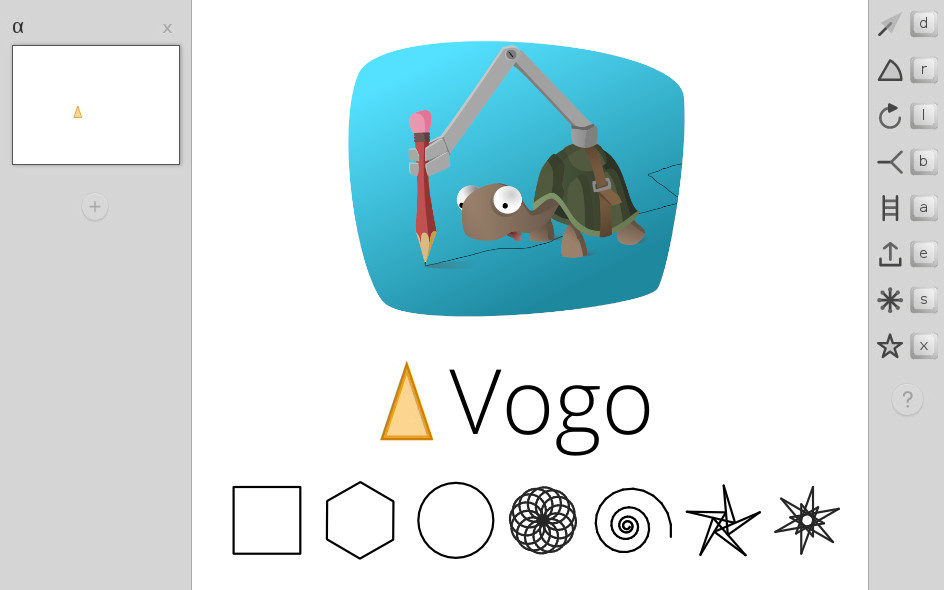

Vogo
====

Vogo is a research prototype to try some ideas for the direct manipulation of Logo Turtle Graphics.

http://rbyte.github.io/Vogo/
http://mgrf.de/vogo/

[Master Thesis - Direct Manipulation of Turtle Graphics]("Master Thesis - Direct Manipulation of Turtle Graphics.pdf").

[Walkthrough Video](https://vimeo.com/113843398)

License: GNU Affero General Public License 3

Author: Matthias Graf, 2014

